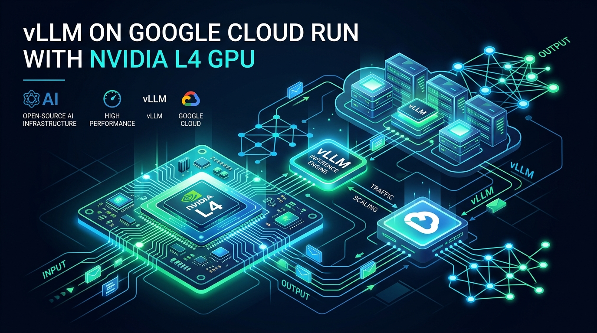

<div align="center">

# ⚡ vLLM on Google Cloud Run with NVIDIA L4 GPU

[](https://cloud.google.com/run)
[](https://www.nvidia.com/en-us/data-center/l4/)
[](https://github.com/vllm-project/vllm)
[](LICENSE)

An enterprise-grade, infrastructure-as-code automation setup to deploy **vLLM** on **Google Cloud Run** with **1x NVIDIA L4 GPU (24GB VRAM)** and model weights mounted seamlessly from **Google Cloud Storage (GCS)** via **Cloud Storage FUSE**.



</div>

---

## 🌟 Highlights & Features

* **⚡ Ultra-Low Latency & High Throughput:** Powered by vLLM's **PagedAttention** and continuous batching for maximum token throughput.
* **🚀 Serverless GPU Autoscaling:** Scales dynamically from **0 to N instances** (scales to zero when idle to minimize cloud costs).
* **📦 Zero-Copy Weight Mounting:** Mount Hugging Face model snapshots (`Qwen2.5`, `Llama 3.3`, `DeepSeek R1`) directly from GCS via **Cloud Storage FUSE**.
* **🔌 OpenAI-Compatible API:** Instant drop-in replacement for OpenAI SDK, supporting streaming responses, tool calling, and guided structured JSON outputs.
* **🖥️ Local Testing & Dashboard Included:** Features MLX local Mac inference testing and an interactive web GUI dashboard.

---

## 🏗️ Architecture

```text
                                  +------------------------------------+
                                  | Client / OpenAI SDK / LangChain /  |
                                  |         cURL / Dashboard           |
                                  +-----------------+------------------+
                                                    | (HTTPS Stream)
                                                    v
+---------------------------------------------------+---------------------------------------------------+
| Google Cloud Run (Serverless GPU Service)                                                              |
|                                                                                                       |
|  +---------------------------+    +----------------------------+    +------------------------------+  |
|  |  Accelerator: 1x L4 GPU   |    |  vLLM OpenAI Server Container |    | GCS FUSE Volume Mount        |  |
|  |  (24GB GDDR6 VRAM)        | ◄──┤  vllm/vllm-openai:latest  ├─►  | /mnt/models                  |  |
|  +---------------------------+    +----------------------------+    +--------------+---------------+  |
+------------------------------------------------------------------------------------|------------------+
                                                                                     v
                                                                   +-----------------+------------------+
                                                                   |  GCS Bucket: gs://${BUCKET_NAME}   |
                                                                   |  (Model Weights Storage)           |
                                                                   +------------------------------------+
```

---

## 📁 Repository Structure

| File / Directory | Description |
| :--- | :--- |
| `deploy.sh` | 🚀 **One-click deployment script** for provisioning GCP IAM, GCS buckets, and Cloud Run GPU. |
| `service.yaml` | 📄 Declarative Knative / Cloud Run definition with GPU specs and FUSE mounts. |
| `sync_model.py` | 📦 Hugging Face snapshot downloader & GCS rsync tool. |
| `client_test.py` | 📊 Automated latency profiler (TTFT, TPOT, Tokens/sec, Structured Output). |
| `run_dashboard.sh` | 🖥️ Launcher for the interactive local management dashboard & RAG contract demo. |
| `document_intelligence_rag.py` | 📑 Code-ready Enterprise Contract RAG & Guided Extraction App. |
| `CASE_STUDY.md` | 📘 Complete Industry Case Study & CFP Presentation Guide. |

---

## 🚀 Quickstart Guide

### 1. Environment Setup
Copy the environment template and configure your GCP variables:
```bash
cp .env.example .env
```

Edit `.env`:
```ini
GCP_PROJECT_ID=your-gcp-project-id
GCP_REGION=us-central1
BUCKET_NAME=your-gcp-project-id-vllm-models
MODEL_ID=Qwen/Qwen2.5-7B-Instruct
MODEL_SUBDIR=models/Qwen2.5-7B-Instruct
SERVED_MODEL_NAME=qwen-7b
VLLM_API_KEY=sk-vllm-secure-token-12345
```

### 2. Stage Model Weights to GCS
Install staging dependencies and upload model weights from Hugging Face:
```bash
python3 -m venv .venv
source .venv/bin/activate
pip install -r requirements.txt

python sync_model.py \
    --model Qwen/Qwen2.5-7B-Instruct \
    --bucket your-gcp-project-id-vllm-models \
    --subdir models/Qwen2.5-7B-Instruct
```

### 3. Deploy to Cloud Run GPU
Run the automated deployment script:
```bash
chmod +x deploy.sh
./deploy.sh
```

---

## 🧪 Testing the Endpoint

### Via `curl` (Streaming Response)
```bash
export SERVICE_URL="https://vllm-l4-server-xxxxx.a.run.app"
export VLLM_API_KEY="sk-vllm-secure-token-12345"

curl -X POST "${SERVICE_URL}/v1/chat/completions" \
  -H "Content-Type: application/json" \
  -H "Authorization: Bearer ${VLLM_API_KEY}" \
  -d '{
    "model": "qwen-7b",
    "messages": [
      {"role": "system", "content": "You are an expert AI cloud engineer."},
      {"role": "user", "content": "Explain PagedAttention in 2 sentences."}
    ],
    "stream": true
  }'
```

### Via Python Test Client (Latency Profiling)
```bash
SERVICE_URL="https://vllm-l4-server-xxxxx.a.run.app" python client_test.py
```
Outputs:
* ⏱️ **Time To First Token (TTFT)**
* ⚡ **Time Per Output Token (TPOT)**
* 🚀 **Effective Output Speed (Tokens/sec)**
* 🧩 **Guided Structured Output Validation**

---

## 🖥️ Local Mac Development (MLX / Ollama)

For local testing on Apple Silicon Macs without cloud deployment:
```bash
# Install MLX LM
pip install mlx-lm

# Run local OpenAI-compatible server
mlx_lm.server --model mlx-community/Qwen2.5-7B-Instruct-4bit --port 8000
```

---

<div align="center">
  <sub>Built with ❤️ for Cloud Architecture & Open-Source AI Deployment</sub>
</div>
